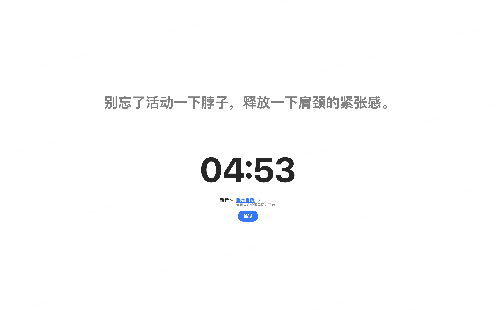

# Muyu: The Perfect Combination of Productivity and Health

In today's fast-paced life, time management and health have become increasingly important topics. Many people feel anxious at work and often neglect their own well-being. However, there is an application called "Muyu" that cleverly combines the Pomodoro Technique with hydration reminders, providing users with a perfect solution to enhance productivity while maintaining good health.

## The Pomodoro Technique: The Secret to Productivity

"Muyu" incorporates the Pomodoro Technique, a widely recognized time management technique, into its functionality. It divides work time into short work intervals, typically 25 minutes each, called "Pomodoros". After each Pomodoro, the app reminds you to take a 5-minute break before starting the next Pomodoro. After completing four Pomodoros, you can take a longer break, typically 15-30 minutes. This rhythmic work approach helps improve focus, productivity, and reduces work-related anxiety.

    
    
    

## Hydration Reminders: Maintaining Physical Health

Another unique aspect of the "Muyu" app is its hydration reminders. It not only serves as a time management tool but also acts as a caring health companion. The app reminds you to drink water at regular intervals to ensure you maintain good hydration habits. You can customize the reminder frequency and the amount of water to drink each time based on your needs and preferences. Additionally, "Muyu" provides statistics to help you track your hydration progress, assisting you in maintaining good physical health.

    
    

## Customization Options

"Muyu" app places great emphasis on user customization. You can personalize the duration of Pomodoros, break times, and reminder frequencies according to your work and lifestyle needs. Additionally, you can set daily hydration goals, and the app will help you achieve a healthy hydration routine. This high level of customization makes "Muyu" suitable for various users and work scenarios.

    
    
    

## Managing Time and Health Simultaneously

The "Muyu" app is a unique tool that not only enhances productivity but also prioritizes your health. By combining the Pomodoro Technique with hydration reminders, it helps users manage their time effectively, stay focused, and maintain physical well-being. Whether you are a busy professional, a student, or anyone seeking to improve productivity and health, "Muyu" can provide valuable assistance.

If you also wish to be more efficient at work while taking care of your health, consider trying the "Muyu" app. It may become your ideal assistant. Download and install the "Muyu" app to experience a more structured work routine and a healthier lifestyle.
